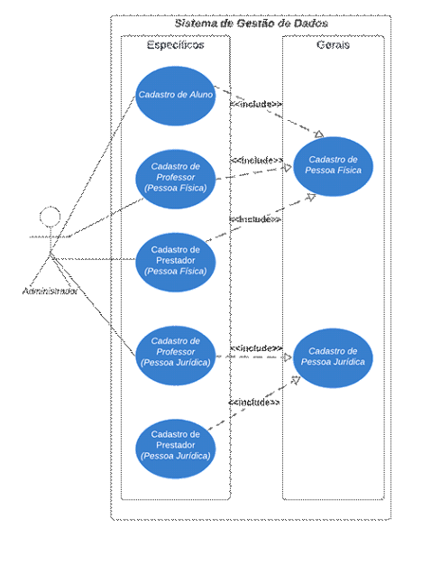
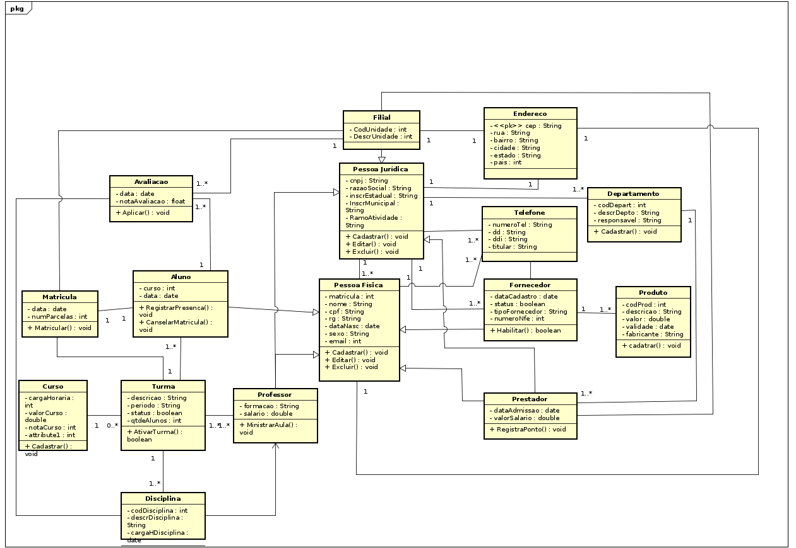

# Documento de Requisitos de Sistema
### Sistema de Gestão Para Universidade
### Versão 2.0 (Segunda Versão)
---
### 1.0  Introdução.
Esse sistema é voltado para empresas que pretedem atuar no ramo educacional e  integrar todos os setores, desde a portaria até aplicações de avaliações em todas as unidades e para todos os cursos oferecidos. Disponibiliza também aos gestores informações relevantes para auxiliá-los na sua tomada de decisão. Pensado para atuar em plataforma web, permite aos usuários o uso em desktop e dispositivos móveis android.
### 2.0  Convenções e abreviações.
UC ; UML; RF; RNF; PF; PJ.
### 3.0  Identificação dos requisitos.
Serão utilizados como identificador dos requisitos a forma padão, UC001 para caso de uso, RF001 para
requisitos funcionais e RNF001 para requisitos não funcionais, PF para pessoa física e PJ para pessoa jurídica.
### 4.0  Identificação dos requisitos.
Como padrão de prioridade vamos utilizar as seguintes notações, ***essencial, importante e desejável.*** Esses padrões servirão para identificar o grão de importância para cada requisito a ser desenvolvido. ***Essencial*** vamos utilizar para identificar que sem esses requisitos o sistema não pode ser instalado ou a etapa seguinte do sistema dependerá desses requisitos. Os requisitos ***importantes*** fazem parte do sistema, mas podem ser implementados nas etapas seguintes sem comprometer a instalação do sistema. Os requisitos ***desejáveis*** são aqueles que não comprometem a funcionalidade do sistema, podem ser instalados posteriormente e garantem qualidade, usabilidade e desempenho. 
### 5.0  Descrição geral do sistema (Conceitual).
O objetivo desse projeto é desenvolver um sistema para gestão educacional que
disponibilize os seguintes requisitos aos usuários. No ***cadastro para pessoa jurídica*** o administrador dever
informar o ***cnpj, a inscrição estadual, a inscrição municipal e ramo de atividade*** da
empresa. Uma empresa do ramo educacional possui várias filiais e essas filiais devem
ser identificadas pelo ***código da unidade, descrições e o responsável pela unidade***.
Todos os ***departamentos*** também serão cadastrados e cada departamento terá o seu
***código de identificação, descrição do departamento e o responsável por cada
departamento***. As empresas poderão ter um ou mais ***telefones cadastrados*** e no seu
cadastro deverá conter, ***número do telefone, o código da cidade, código do país e o
titular da conta***. Cada ***unidade*** deve ter seu próprio ***endereço que serão cadastrados*** com os
seguintes dados: ***cep, rua, bairro, cidade, estado e país***. No ***cadastro para pessoa
física*** deve conter a ***cpf, rg, nome, sobrenome, email e data de nascimento***. Uma
pessoa pode ser um ***aluno, um professor, um fornecedor ou até mesmo um visitante***.
Caso essa pessoa seja um ***fornecedor o cadastrado*** deve conter os seguintes
atributos ***matrícula, data do cadastro, descrição dos produtos, valor do produto e
tipo do fornecedor***. Um fornecedor pode ser uma pessoais física e os seus atributos
deverão estar contidos como ***cadastro pessoa física***. O fornecedor para estar ativo deve
fornecer um ou mais produtos e esses ***produtos devem ser cadastrados*** e identificados
pelo ***código, descrição do produto, valor do produto, validade do produto
e nome do fabricante***. Uma pessoa também pode ser um aluno e, para o ***cadastro de
alunos*** será solicitado ***cpf, rg, nome, sobrenome, data de nascimento, sexo e data do
cadastro***. O sistema deve permitir que o aluno realize sua ***matrícula*** onde, cada aluno
deve informar o ***cpf, nome do curso, polo, endereço de e-mail, período e
turma***. Os seus dados pessoais devem estar previamente cadastrados no ***cadastro
pessoa física***. Durante o período de provas os alunos devem ***escolher as datas para suas avaliações***
previamente. Os alunos para ***agendar suas avaliações*** devem informar ***nome da matéria a data da
avaliação, horário e unidade***. A nota obtida deve ser igual ou
maior que a nota mínima para aprovação do curso. Um ***professor*** para fazer parte do quadro de colaboradores deve estar ***cadastrado*** e, para realização do ***cadastro de professores*** o sistema deve solicitar o ***número do cpf, Rg, data da realização do cadastro, unidade desejada e formação acadêmica***.

### 6.0 Requisitos funcionais do sistema.

| Ref | Descrição   | Prioridade | 
| ----------- | ----------- |----------- | 
| RF001   | O sistema deve fornecer um formulário para cadastro de pessoa física  |Essecial|
| RF002   | O sistema deve fornecer um formulário para cadastro de pessoa jurídica  |Essecial|
| RF003   | O sistema deve fornecer um formulário para cadastro de professores Pf  |Essecial|
| RF004   | O sistema deve fornecer um formulário para cadastro de professores PJ  |Essecial|
| RF005   | O sistema deve fornecer um formulário para cadastro de fornecedores Pf  |Essecial|
| RF006   | O sistema deve fornecer um formulário para cadastro de fornecedores PJ  |Essecial|
| RF007   | O Sistema deve fornecer um formulário para cadastro de alunos           |Essecial|
| RF008   | O sistema deve disponibilizar um formulário para cadastro de departamentos |Importante|
| RF009   | O sistema deve fornecer um formulário para cadastro de produtos  |Importante|
| RF010   | O sistema deve fornecer um formulário para cadastro dos cursos  |Importante|
| RF011   | O sistema deve fornecer um formulário para cadastro das unidades  |Importante|
| RF012   | O sistema deve fornecer um formulário para cadastro das disciplinas |Importante|
| RF013   | O sistema deve fornecer um formulário para efetuar a matrícula |Importante|

### 6.1  Requisitos não funcionais e de qualidade do sistema.
| Ref     | Descrição | Categoria     | 
| ----------- | ----------- |-----------| 
| RNF001   | O Sistema não deve permitir cadastro com duplicidade  |Confiabilidade|
| RNF002   | O Sistema não deve permitir acesso para usuário que não esteja logado  |Usuabilidade|
| RNF003   | O sistema não deve aceitar dados do tipo texto em campo numérico |Usuabilidade|
| RNF004   | Ao finalizar o cadastro o sistema deve retornar uma mensagem de confirmação  |Usuabilidade|
| RNF005   | Todos os dados trafegados deverão ser encriptados |Segurança|
| RNF006   | A interface deve ter navegação padronizada, assim como elementos visuais padronizados por guia de estilo  |Usuabilidade|
| RNF007   | O sistema deve ficar disponível 99,9% do tempo |Confiabilidade|
| RNF008   | O sistema deve ser capaz de lidar com altas demandas como em datas para matrículas e rematrículas |Escalabilidade|
| RNF009   | O sistema deve permitir que o usuário utilize a tecla ***ENTER*** para confimação dos dados  |Usuabilidade|
| RNF010   | O sistema deve permitir que o usuário utilize a tecla ***TAB*** para mudar de campo  |Usuabilidade|
| RNF011   | Após a confirmação dos dados cadastrados o cursor do mouse deve retornar para o campo inicial |Usuabilidade|
| RNF012   | Os campos CNPJ/CPF devem conter formatações e validações  |Segurança|
| RNF013   | Para os cadastros ***Pj, professores, fornecedores e alunos***, o sistema de solicitar o cadastro ***Pf*** |Segurança|

### 7.0  Diagrama de caso de uso.

### 8.0 Diagrama de classe UML

### 9.0  Descrições dos casos de uso.
#### 9.1  Cadastro Pessoa Física.
| Nome do cenário: Cadastro de pessoa física   Atores:   Pré-condição | [UC001] Cadastro Pf   Cliente, Funcionario, Adm   Não está cadastrado |
| :---        |          :---: |
| ***Fluxo Principal*** | ***Fluxo de Exceção - Usuário não autenticado***   |
| 1. O Sistema exibe a tela de cadastro pessoa física   2. O usuário digita o número do Cpf   3. O usuário digita o número do Rg   4. O usuário digita o nome   5. O usuário digita o sobrenome   6. O usuário digita o e-mail   7. O usuário digita a data de nascimento   8. O usuário seleciona o sexo  9. O usuário confirma os dados informados   10. O sistema salva os dados   11. O sistema exibe a mensagem (fluxo alternativo 1) |1. O sistema detecta que o usuário não fez o login 2. O sistema exibe a tela de login/senha 3. O usuário digita o login e a senha 4. O sistema conecta o usuário na plataforma 5. O usuário é redirecionado para tela de cadastro|
| ***Fluxo Alternantivo 1 - Editar dados cadastrados*** | |
| 1. O Sistema exibe a tela de cadastro pessoa física   2. O usuário digita o número do Cpf   3. O sistema exibe a mensagem usuário já cadastrado   4. O sistema carrega os dados do usuário na tela   5. O sistema habilita os campos para edição   6. O usuário confirma as alterações   7. O sistema salva as alterações   8. O sistema exibe a mensagem (Fluxo Alternativo – 1) |  |
| ***Fluxo Alternantivo 2 - Dados inválidos***      |   |
| 1. O Sistema exibe a tela de cadastro pessoa física   2. O usuário digita o número do Cpf   2. O sistema exibe a mensagem dados inválidos;   3. O sistema retorna ao passo 2 do fluxo alternativo 1  | |
| ***Pós condições***      |   |
| 1. O Sistema exibe os dados cadastrados com o número do registro   2. O sistema envia o cadastro para impreessão | |

----
#### 9.2  Cadastro Pessoa Jurídica.
| Nome do cenário: Cadastro de pessoa jurídica   Atores:   Pré-condição: | [UC002] Cadastro Pj  Cliente, Funcionario, Adm   Cadastrado [UC001], Autenticado |
| :---        |          :---: |
| ***Fluxo Principal*** | ***Fluxo de Exceção - Usuário não autenticado***   |
| 1. O Sistema exibe a tela de cadastro pessoa Jurídica   2. O usuário digita o número do Cnpj   3. O usuário digita o número da inscrição Estadual   4. O usuário digita o número da escrição municipal   5. O usuário seleciona o ramo de atividade  9. O usuário confirma os dados informados   10. O sistema salva os dados   11. O sistema exibe a mensagem ("Dados alterados com sucesso") |1. O sistema detecta que o usuário não fez o login 2. O sistema exibe a tela de login/senha 3. O usuário digita o login e a senha 4. O sistema conecta o usuário na plataforma 5. O usuário é redirecionado para tela de cadastro|
| ***Fluxo Alternantivo 1 - Editar dados cadastrados*** | |
| 1. O Sistema exibe a tela de cadastro pessoa jurídica   2. O usuário digita o número do Cnpj   3. O sistema exibe a mensagem empresa já cadastrado   4. O sistema carrega os dados da empresa na tela   5. O sistema habilita os campos para edição   6. O usuário confirma as alterações   7. O sistema salva as alterações   8. O sistema exibe a mensagem ("Dados alterados com sucesso") |  |
| ***Fluxo Alternantivo 2 - Dados inválidos***      |   |
| 1. O Sistema exibe a tela de cadastro pessoa jurídica   2. O usuário digita o número do Cnpj   2. O sistema exibe a mensagem dados inválidos   3. O sistema retorna ao passo 2 do fluxo alternativo 1  | |
| ***Pós-condição:***      |   |
| 1. O Sistema gera e exibe os dados cadastrados com o número do registro   2. O sistema envia o cadastro para impreessão | |

----
#### 9.3  Cadastro De Professores.
| Nome do cenário: Cadastro de Professores   Atores:   Pré-condição: | [UC003] Cadastro Pf/Pj   Professor, Funcionario, Adm  Cadastrado [UC001], Autenticado) |
| :---        |          :---: |
| ***Fluxo Principal*** | ***Fluxo de Exceção - Usuário não autenticado***   |
| 1. O Sistema exibe a tela para cadastro de  Professores   2. O Professor digita o número do cpf   3. O Sistema exibe os dados cadastrais do professor (UC001 Cadastro Pf)   4. O professor seleciona o tipo do cadastro (PF/PJ)   5. O Professor seleciona a unidade  9. O Professor informa a formação acadêmica   10. O Professor confirma os dados   11. O sistema gera o número da matrícula   12. O sistema salva o cadastro   13. O sistema exibe a mensagem de confirmação|1. O sistema detecta que o usuário não fez o login 2. O sistema exibe a tela de login/senha 3. O usuário digita o login e a senha 4. O sistema conecta o usuário na plataforma 5. O usuário é redirecionado para tela de cadastro|
| ***Fluxo Alternantivo 1 - Editar dados cadastrados*** | |
| 1. O Sistema exibe a tela para cadastro de Professores   2. O Professor digita o número do Cpf   3. O sistema exibe a mensagem "dados já cadastrados"   4. O sistema exibe os dados do cadastro   5. O sistema habilita os campos para edição   6. O Professor confirma as alterações   7. O sistema salva as alterações   8. O sistema exibe a mensagem de confirmação|  |
| ***Fluxo Alternantivo 2 - Dados inválidos***      |   |
| 1. O Sistema exibe o cadastro de Professores   2. O Professor digita o número do Cpf   2. O sistema exibe a mensagem dados inválidos   3. O sistema retorna ao passo 2 do fluxo alternativo 1  | |
| ***Pós-condição***      |   |
| 1. O Sistema exibe os dados cadastrais e o número da matrícula   2. O sistema envia o cadastro para impreessão | |

----
#### 9.4  Cadastro De Fornecedores.
| Nome do cenário: Cadastro para fornecedores   Atores:   Pré-condição: | [UC004] Cadastro Pf/Pj   Fornecedor, Funcionario, Adm  Cadastrado [UC001], Autenticado) |
| :---        |          :---: |
| ***Fluxo Principal*** | ***Fluxo de Exceção - Usuário não autenticado***   |
| 1. O Sistema exibe o cadastro para Fornecedores   2. O Fornecedor digita o número do cpf   3. O Sistema exibe os dados cadastrais do fornecedor (UC001 Cadastro Pf)   4. O Fornecedor seleciona o tipo do cadastro (PF/PJ)   5. O Fornecedor digita o número do Cnpj 6. O Fornecedor digita o número da Inscrição estadual   7. O Fornecedor digita o número da inscrição municipal   8. O Fornecedor seleciona o ramo de atividade   9. O Fornecedor seleciona os produtos  10. O Fornecedor confirma as informações 11. O sistema gera o número da matrícula   12. O sistema salva as informações 13. O Sistema exibe o cadastro para impressão |1. O Sistema detecta que o usuário não fez o login 2. O Sistema exibe a tela para login/senha 3. O Fornecedor digita o login e a senha 4. O sistema conecta o usuário na plataforma 5. O Fornecedor é redirecionado para tela de cadastro|
| ***Fluxo Alternantivo 1 - Editar dados cadastrados*** | |
| 1. O Sistema exibe o cadastro para fornecedores   2. O Fornecedor digita o número do Cpf   3. O sistema exibe a mensagem dados já cadastrados   4. O sistema carrega os dados do Fornecedor na tela   5. O sistema habilita os campos para edição   6. O Fornecedor confirma as alterações   7. O sistema salva as alterações   8. O sistema exibe a mensagem  de confirmação|  |
| ***Fluxo Alternantivo 2 - Dados inválidos***      |   |
| 1. O Sistema exibe a tela para cadastro de fornecedores   2. O Fornecedor digita o número do Cpf   2. O sistema exibe a mensagem dados inválidos   3. O sistema retorna ao passo 2 do fluxo alternativo 1  | |
| ***Pós-condição***      |   |
| 1. O Sistema exibe os dados cadastrais e o número da matrícula   2. O sistema envia o cadastro para impreessão | |

----
#### 9.5  Cadastro De Alunos.
| Nome do cenário: Cadastro para Alunos   Atores:   Pré-condição: | [UC005] Cadastro   Aluno, Funcionario, Adm  Cadastrado [UC001], Autenticado) |
| :--- | :---: |
| ***Fluxo Principal*** | ***Fluxo de Exceção - Usuário não autenticado***   |
| 1. O Sistema exibe a tela para cadastro de alunos   2. O Aluno digita o número do cpf   3. O Sistema exibe os dados cadastrais do aluno (UC001 Cadastro Pf)   4. O Aluno seleciona o a unidade   5. O Aluno seleciona o curso desejado  6. O Aluno seleciona o período   7. O Aluno seleciona a forma de pagamento   8. O Aluno seleciona o número de parcelas   9. O sistema envia uma mensagem de confirmação para o e-mail cadastrado   10. O aluno confirma o cadastro 11. O Sistema gera o número da matrícula   12. O sistema salva as informações 13. O Sistema exibe o cadastro para impressão |1. O Sistema detecta que o usuário não fez o login 2. O Sistema exibe a tela para login/senha 3. O Fornecedor digita o login e a senha 4. O sistema conecta o usuário na plataforma 5. O Aluno é redirecionado para tela de cadastro|
| ***Fluxo Alternantivo 1 - Editar dados cadastrados*** | |
| 1. O Sistema exibe a tela de cadastro para alunos   2. O Aluno digita o número do Cpf   3. O sistema exibe a mensagem dados já cadastrados   4. O sistema carrega os dados do fornecedor na tela   5. O sistema habilita os campos para edição   6. O Aluno confirma as alterações   7. O sistema salva as alterações   8. O sistema exibe a mensagem  de confirmação|  |
| ***Fluxo Alternantivo 2 - Dados inválidos*** |   |
| 1. O Sistema exibe a tela para cadastro de aluno   2. O Aluno digita o número do Cpf   2. O sistema exibe a mensagem dados inválidos   3. O sistema retorna ao passo 2 do fluxo alternativo 1  | |
| ***Pós-condição*** |   |
| 1. O Sistema exibe os dados cadastrais e o número da matrícula   2. O sistema envia o cadastro para impreessão   3. O sistema envia uma mensagem de boas vindas para o e-mail cadastrado | |
----
### 10.0  Prototipação.
####  10.1  Cadastro Pessoa Física.

----
####  10.2  Cadastro Pessoa Jurídica.

----
####  10.3  Cadastro Pessoa Professores.

----
####  10.4  Cadastro Pessoa Alunos.

----
####  10.4  Cadastro Pessoa Fornecedores.

----
